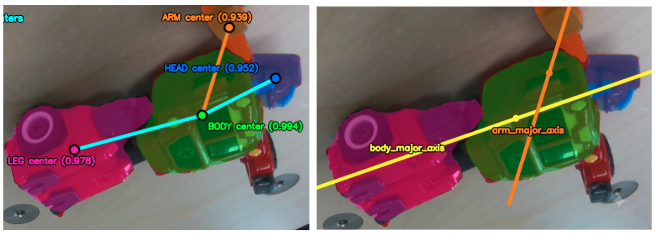
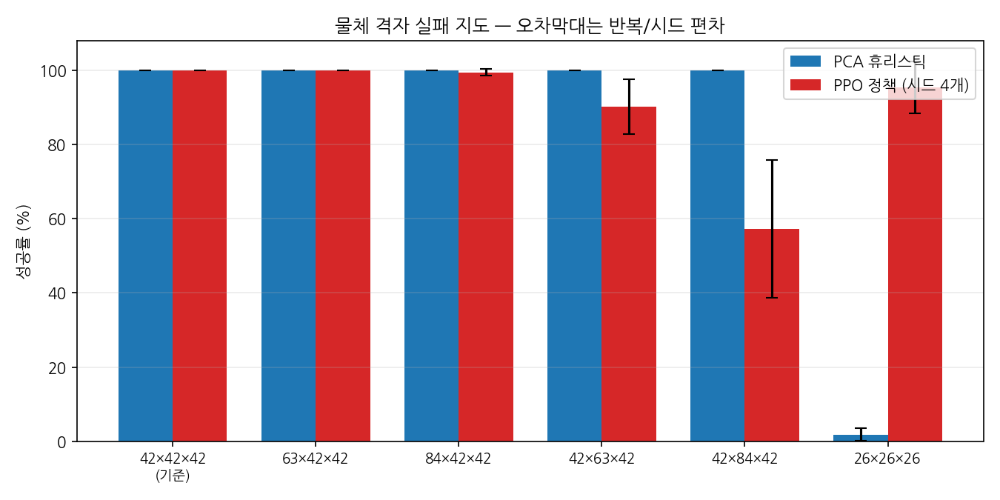
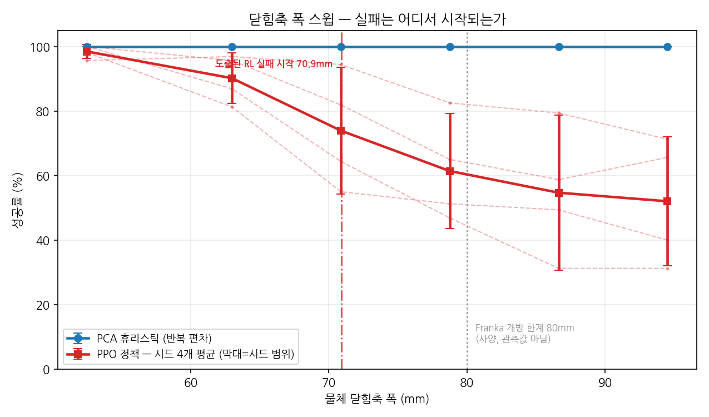
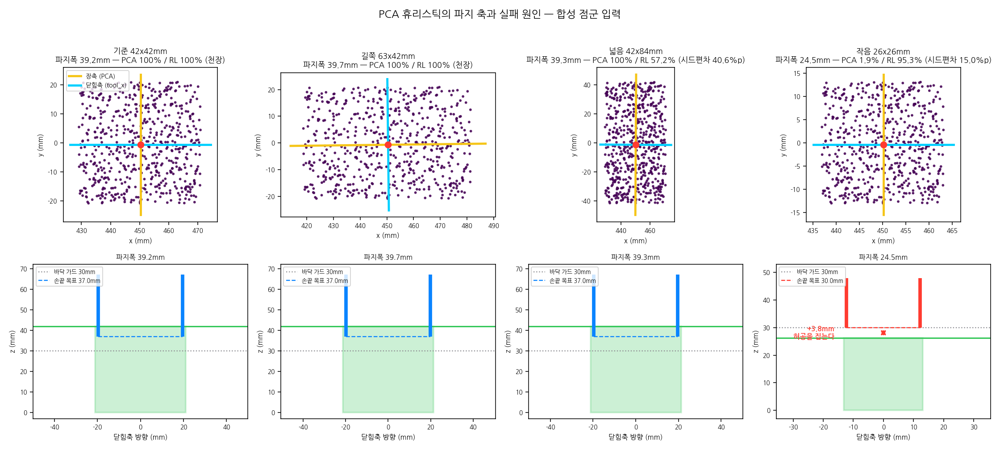
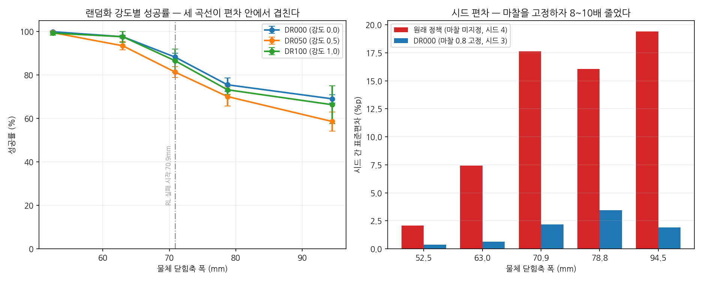

# isaac-grasp-bench

> **한 줄 요약**
> 로봇 팔이 물체를 집는 두 가지 방법 — **규칙 기반 알고리즘**과 **강화학습** — 을
> 시뮬레이션에서 **같은 조건으로** 겨루게 하고, 그 차이가 **진짜인지 우연인지** 통계로 가린 기록.

> **결론부터**
> - 두 방식의 차이를 **통계적으로 주장할 수 있는 조건은 하나도 없었다.**
> - 주장했다가 **스스로 철회한 결론이 네 개** 있다. 그 철회 과정이 이 프로젝트의 실제 내용이다.
> - 원래 목표(휴리스틱의 실패 지도)는 **아직 미완성**이다. 왜 그런지도 아래에 적었다.

---

## 1. 이게 무슨 프로젝트인가

### 배경 — 실기에서 겪은 것



*실기 파이프라인([cobot2_jarvis](https://github.com/Dmk1999s/cobot2_jarvis)):
YOLO 로 물체를 분할하고(왼쪽), 그 점들에 PCA 를 걸어 긴 방향을 찾는다(오른쪽).*

- 두산 M0609 로봇 팔 + OnRobot RG2 그리퍼로 **점군 PCA 파지 알고리즘**을 만들어 돌려봤다.
- **동작은 했다.** 그런데 말할 수 없는 게 있었다 — **"어떤 조건에서 왜 실패하는가?"**
- 실기에서는 물체 자세도, 조명도, 마찰도 통제할 수 없기 때문이다.

> **"잘 됩니다"** 와 **"이 조건에서 이만큼 실패하고, 그 구간을 이렇게 줄였습니다"** 는 다른 말이다.
> 이 프로젝트는 **후자를 할 수 있게 만드는 것**이 목적이다.

### 그래서 하려던 것

시뮬레이션으로 옮겨 조건을 통제하고 —

1. 규칙 기반 알고리즘의 **실패 지도**를 그린다 (어떤 물체에서 몇 % 실패하는가)
2. 같은 조건에서 강화학습 정책의 실패 지도를 **나란히** 그린다
3. 두 차이가 **측정 노이즈보다 큰지** 검정한다

---

## 2. 용어 (모르면 여기부터)

| 용어 | 뜻 |
|---|---|
| **PCA 파지 휴리스틱** | 물체의 점 구름을 보고 **가장 긴 방향**을 계산한 뒤, 거기 **수직으로** 그리퍼를 벌려 잡는 규칙 기반 알고리즘. 학습이 없다. |
| **강화학습 정책 (PPO)** | 시뮬레이터에서 수천만 번 시행착오하며 **스스로** 잡는 법을 익힌 신경망. 여기서는 4096개 환경에서 1500번 반복 학습했다. |
| **시드(seed)** | 학습 시작 시 난수를 정하는 값. **같은 설정이라도 시드가 다르면 다른 정책이 나온다.** 이 프로젝트의 핵심 골칫거리. |
| **에피소드** | 물체 하나를 집으려 한 시도 1회. 성공/실패로 끝난다. |
| **성공 기준** | 내가 정하지 않고 Isaac Lab 이 원래 쓰는 정의를 그대로 썼다 (`object_is_lifted`, 4cm 이상 들어올리면 성공). |
| **판단 보류** | 두 방식의 차이가 **측정할 때마다 흔들리는 폭보다 작다**는 뜻. "차이 없음"이 아니라 **"이 데이터로는 말할 수 없음"** 이다. |
| **분포 밖 (OOD)** | 학습할 때 본 적 없는 조건. 예: 42mm 정육면체로만 학습했는데 84mm 물체를 주는 경우. |
| **헤드리스** | 화면 없이 서버에서 돌리는 것. |

---

## 3. 실험 설계 원칙 5가지

> 이 프로젝트의 가치는 "학습이 돌아간다"가 아니라 **"개선을 증명할 수 있다"** 에 있다.
> 그래서 아래는 협상 대상이 아니고, 코드로 강제한다.

1. **비교군 사이에 달라지는 변수는 '제어 방식' 하나뿐이다.**
   - 둘 다 Isaac Lab 안의 **같은 Franka Panda 로봇**을 쓴다.
   - 과거 실기(M0609) 결과는 비교에 쓰지 않는다 — 로봇도 그리퍼도 다르면 차이의 원인을 못 따진다.

2. **같은 시드, 같은 물체 배치, 같은 지표.** 평가용 시드는 학습용 시드와 분리한다.

3. **노이즈를 먼저 잰다.** 같은 설정을 여러 번 반복해 흔들리는 폭을 구한다.
   - 두 조건의 차이가 그 폭보다 작으면 **"판단 보류"** 로 적는다. 개선도 악화도 주장하지 않는다.

4. **합격 기준을 미리 정하지 않는다.** 임계값은 **관측치에서 도출**한다.
   - 예: "80mm 에서 실패할 것이다"라고 박아두지 않고, 실제로 꺾이는 지점을 찾는다.

5. **커버리지를 줄였으면 기록한다.** 조용한 축소는 "다 했다"로 읽힌다.

> 2\~5번 설계는 앞서 만든 자율주행 평가 하네스
> [awsim-autoware-bench](https://github.com/Dmk1999s/awsim-autoware-bench) 에서 가져와 재사용했다.

---

## 4. 재기 전에 — "이 하네스를 믿어도 되나"

### 하네스가 실제로 파지를 재고 있다는 증거

- 처음 만든 하네스는 성공률 **100%** 를 냈다.
- **일부러 틀린 파지**(목표를 20cm 어긋나게)를 넣어봤더니 **그것도 100%** 였다.
- 아무것도 재고 있지 않았던 것이다.

그래서 **대조군을 상시로 넣는다**:

| 조건 | 성공률 |
|---|---|
| 정상 파지 | 95.6% (반복 편차 2.6%p) |
| **파지 자세를 20cm 어긋나게 (대조군)** | **0.0%** |

- 대조군이 0% 여야 **하네스가 파지 성공 여부를 실제로 재고 있다**는 뜻이다.
- 여기서 나온 **반복 편차 2.6%p** 가 이후 비교의 기준선이 됐다.

> 구축 중 잡은 버그 5건 중 **넷은 에러를 내지 않고 실패했다.**
> 증상과 **탐지 방법**은 [docs/WORKLOG.md](docs/WORKLOG.md) 에 남겼다.

### 격자가 없었으면 못 찾았을 버그

- 기본 조건(정육면체)에서 두 방식 모두 **100%** 였다. "천장 효과"로 넘어갈 뻔했다.
- 물체 형상을 바꿔가며 훑었더니 PCA 가 길쭉한 물체에서 **20% / 0%** 로 무너졌다.
- 원인: **그리퍼 프레임 규약이 90도 어긋나** 있었다.
  (휴리스틱은 닫힘축을 `tool_x` 로, Franka 손가락은 `hand` 프레임 y 축으로 벌어진다)
- **정사각 큐브에서는 대칭이라 아무 증상이 없었다.** 수정 후 같은 셀이 100%/100% 로 돌아왔다.

> 100% 라는 숫자를 의심하지 않았다면 영영 못 찾았을 버그다.

### 실기 코드를 그대로 옮겼다

`src/grasp_pca_core.py` — 실기에서 돌던 520줄 알고리즘의 이식본.

- **알고리즘 본체는 원본과 `diff` 완전 일치**를 유지했다.
  - 베이스라인이 실기의 그 알고리즘이 아니면, 비교 결과를 "제어 방식의 차이"로 귀속할 수 없다.
- ROS2 의존은 걷어냈다. 실제로 쓰는 건 순수 numpy 함수 하나뿐이었고,
  ROS2 는 **휴리스틱이 호출하지도 않는 함수**에만 갇혀 있었다 — 알고리즘 의존이 아니라 **import 부수효과**였다.
- 로봇 상수만 교체했고, 값은 추정하지 않고 **Isaac Lab 소스에서 확인**했다:

| 상수 | M0609 + RG2 (실기) | Franka Panda (시뮬) |
|---|---|---|
| 플랜지→손끝 | 228.6 mm | **103.4 mm** |
| 그리퍼 최대 개방 | 110 mm | **80 mm** |

- 상수 교체가 형식적이지 않았음을 보이는 테스트도 넣었다 —
  폭 90mm 물체는 RG2(110mm)로는 잡히지만 **Franka(80mm)로는 예외가 나야 한다.**

### 실기 상수는 조용히 발목을 잡는다

- 휴리스틱을 **손대지 않은 상태로는 성공률이 0%** 였다.
- `grasp_depth_mm=5` 가 `grasp_clearance_mm=10` 보다 작아 **손끝이 물체 위에서 멈춘다.**
- 옆에서 접근하던 RG2 워크플로의 값이, 위에서 내려잡는 Franka 에는 맞지 않았다.
- **`depth > clearance`** 라는 물리적 조건을 만족하는 최소값(15mm)을 썼다 — 성공률을 보고 고른 값이 아니다.

> 같은 종류의 상수 문제가 **뒤에 한 번 더** 나온다 (7절). 그때는 결론을 뒤집었다.

---

## 5. 결과 한눈에

### 물체 격자 — 6가지 물체에서 겨루기

셀당 5회 반복 × 32개 환경 = 160 에피소드. RL 은 **시드 8개**를 각각 학습해 평균.

| 물체 (mm) | 어떤 물체인가 | PCA | RL (시드 8개) | 차이 | 노이즈 | 판정 |
|---|---|---:|---:|---:|---:|---|
| 42×42×42 | 기준 (정육면체) | 100.0% | 99.8% | -0.2%p | 1.2%p | 판단 보류 |
| 63×42×42 | 길쭉 | 100.0% | 99.4% | -0.6%p | 5.0%p | 판단 보류 |
| 84×42×42 | 더 길쭉 | 100.0% | 97.3% | -2.7%p | 18.8%p | 판단 보류 |
| 42×63×42 | 잡는 방향이 넓음 | 100.0% | 93.7% | -6.3%p | 18.8%p | 판단 보류 |
| 42×84×42 | 그리퍼 한계 초과 | 100.0% | 66.9% | -33.1%p | 59.4%p | 판단 보류 |
| 26×26×26 | 작음 | 1.9%† | 83.2% | +81.3%p | 96.2%p | **판정 불가** † |



*오차막대는 **최소~최대**다 — 판정에 쓰는 척도와 같다. 막대가 겹치면 판단 보류다.*

- **6개 셀 전부 판단 보류.** 통계적으로 주장할 수 있는 게 없다.
- **경향은 뚜렷하다** — RL 은 물체가 커지거나 작아질수록 무너진다. 다만 **크기를 주장할 수 없다.**
- † 작은 물체 셀은 **판정 자체를 내지 않는다.** 이유는 아래 7절.

### 무너진 결론 네 개

이 표는 이 프로젝트에서 가장 중요한 표다.

| 한때 주장했던 것 | 왜 무너졌나 |
|---|---|
| 1시드로 낸 판정 4개 | 시드를 4개로 늘리니 **절반이 뒤집힘** |
| `42×63×42` — PCA 우세 | 시드 편차(15.6%p)가 차이(9.8%p)보다 컸다 |
| `26×26×26` — RL 우세 (+93.4%p) | **알고리즘이 아니라 내가 넣은 상수**가 만든 결과였다 |
| `42×84×42` — PCA 우세 | 시드를 8개로 늘리니 편차가 59.4%p 로 커져 판단 보류 |

> 전부 **더 잘 재서** 무너뜨렸다. 이게 하네스가 일하고 있다는 증거다.

---

## 6. 어디서부터 실패하는가 — 폭 스윕

- 위 격자는 **성기다.** 42×63(RL 93.7%)과 42×84(66.9%) 사이 어디서 꺾이는지 모른다.
- 그래서 **잡는 방향의 폭만** 6단계로 촘촘히 훑었다. 폭당 PCA 1회 + 시드 8개 = **54회**.



*흐린 점선이 시드별 개별 곡선이다. 평균만 그리면 시드 편차가 지워져 착시가 생긴다.*

| 잡는 방향 폭 | PCA | RL 평균 | RL 중앙값 | RL 시드범위 |
|---|---|---|---|---|
| 52.5mm | 100% | 99.1% | 100.0% | 95.6 ~ 100.0 |
| 63.0mm | 100% | 93.7% | 96.2% | 81.2 ~ 100.0 |
| **70.9mm** | 100% | **79.2%** | 80.3% | 55.0 ~ 99.4 |
| 78.8mm | 100% | 70.4% | 72.8% | 46.9 ~ 95.6 |
| 86.6mm | 100% | 65.9% | 69.1% | 31.2 ~ 96.2 |
| 94.5mm | 100% | 60.8% | 65.9% | 31.2 ~ 95.6 |

**실패 시작점을 관측에서 도출했다** (원칙 4, `scripts/check_criteria.py`):

- 가장 쉬운 조건(52.5mm)에서 흔들리는 폭으로 **허용 밴드**를 만든다.
- 폭을 키우며 **처음 밴드 아래로 내려가는 지점**을 찾는다.
- 결과 → **70.9mm**. 시드를 4개에서 8개로 늘려도 **그대로였다.**

왜 이 값이 중요한가:

- Franka 그리퍼의 **설계 사양은 80mm** 개방이다.
- 그런데 RL 은 **70.9mm 에서** 무너진다 — 물리적 한계가 아니라 **학습에서 본 적 없는 지점**이다.
- 임계값을 미리 80mm 로 박았다면 이 구분을 못 했다.

**PCA 는 94.5mm 까지 전 구간 100%** 다. 넓어지는 축이 긴 변이라, 알고리즘이
자동으로 **짧은 변(42mm)** 쪽을 잡기 때문이다. 그리퍼 한계와 무관하다.

---

## 7. 작은 물체 — "RL 승리"가 사실은 내 실수였던 이야기

이 프로젝트에서 **RL 이 이긴 유일한 셀**이 26mm 물체였다. 그런데:

- 원인을 추적해보니 알고리즘이 아니라 **`FLOOR_CLEARANCE_MM = 30`** 이라는 상수였다.
- 이 상수는 실기에서 **손끝이 작업대를 긁지 않게** 넣은 안전값이다.
- 26mm 물체는 **윗면 높이가 26.2mm** 다. 손끝 목표가 30mm 로 **강제되면서 물체 위 허공에서** 그리퍼가 닫혔다.



*4열에서 빨간 손가락이 초록 상자 **위에 떠 있는** 것이 그것이다.*

### 상수를 조건에 맞게 두고 다시 쟀다

| 크기 (mm) | PCA (`clr=30`) | PCA (조건 만족) | RL 중앙값 | RL 시드범위 (8개) |
|---:|---:|---:|---:|---|
| 18.4 | 0.0% | **100.0%** | **22.5%** | 0.0 ~ 100.0 |
| 21.0 | 0.0% | **100.0%** | 56.9% | 0.0 ~ 100.0 |
| 23.6 | 0.0% | **100.0%** | 84.4% | 1.2 ~ 100.0 |
| 26.2 | 1.9% | **100.0%** | 94.1% | 3.8 ~ 100.0 |
| 31.5 | 100.0% | 100.0% | 99.4% | 63.1 ~ 100.0 |
| 42.0 | 100.0% | 100.0% | 100.0% | 98.8 ~ 100.0 |

- **PCA 는 상수만 맞으면 18.4mm 까지 전부 100%** 다. 작은 물체를 못 잡는 게 아니었다.
- 무너지는 쪽은 오히려 **RL** 이다.
- 즉 "RL 우세 +93.4%p" 는 **제어 방식의 차이가 아니라 내 설정의 차이**였다 (원칙 1 위반).

### 상수는 성공률을 보고 고르지 않았다

26.2mm 물체에 클리어런스를 훑었다:

| `floor_clearance_mm` | 5 | 10 | 15 | 20 | 25 | 30 |
|---|---:|---:|---:|---:|---:|---:|
| 성공률 | 100% | 100% | 100% | 100% | 100% | **1.9%** |

- 5~25 가 **전부 100%** 다 → **10 은 특별한 값이 아니다.**
- 전이는 25 와 30 사이, 곧 **물체 높이(26.25mm) 근처**에서 일어난다.
- 그래서 도출되는 건 값이 아니라 **부등식**이다: **`클리어런스 < 물체 높이`**

> **예측은 부분적으로 틀렸다.** 계산상으로는 "손끝이 윗면보다 높으면 실패"였다.
> 그러면 28.9mm 도 실패해야 하는데 **98.8% 로 성공**한다 — 손가락 패드에 길이가 있어
> 1mm 정도 높아도 잡힌다. **상수에서 임계값을 추론했다면 틀렸을 것이다.**

---

## 8. 물체를 돌려놓으면 — 자세 축

**지금까지 모든 측정이 축 정렬된 상자로만 이뤄지고 있었다.**

- 기본 태스크의 물체 배치는 위치(x, y, z)만 무작위로 흔든다. **회전이 없다.**
- 즉 상자가 늘 반듯하게 놓인다 — **PCA 에게 가장 유리한 입력**이다.
  긴 방향이 곧 좌표축이라 추정이 틀릴 여지가 없다.
- 계획서에는 "물체 **자세**·크기·재질 격자"라고 적어놓고 자세를 안 훑고 있었다.

그래서 `--object_yaw_deg` 를 붙이고 0~90° 를 훑었다. 물체는 **길쭉한 84×42×42** 로 고정
(정육면체는 돌려도 대칭이라 변별력이 없다). 각도당 PCA 1회 + 시드 8개 = **63회**.

| 물체 회전 | PCA | RL 평균 | RL 중앙값 | RL 시드범위 | 판정 |
|---:|---:|---:|---:|---|---|
| 0° | 100.0% | 97.3% | 100.0% | 81.2 ~ 100.0 | 판단 보류 |
| 15° | 100.0% | 98.1% | 99.4% | 90.0 ~ 100.0 | 판단 보류 |
| 30° | 100.0% | 93.2% | 97.2% | 82.5 ~ 100.0 | 판단 보류 |
| 45° | 100.0% | 84.6% | 90.6% | 57.5 ~ 97.5 | 판단 보류 |
| 60° | 100.0% | 75.7% | 81.6% | 41.9 ~ 92.5 | 판단 보류 |
| 75° | 100.0% | **66.6%** | 67.8% | 36.2 ~ 96.2 | 판단 보류 |
| 90° | 100.0% | 66.6% | 69.4% | 41.9 ~ 99.4 | 판단 보류 |

- **PCA 는 전 구간 100%** 다. 예상된 결과다 — PCA 는 **회전 등변**이라 물체를 돌려도
  긴 방향을 그대로 찾는다. 여기서도 실패 시작점이 없다.
- **RL 은 단조롭게 무너진다.** 97.3% → 66.6%. 축 정렬 물체로만 학습했으니
  **회전은 학습 분포 밖**이다.
- 판정은 전부 보류 — 시드 범위가 최대 60%p 로 벌어진다.

> **자세 검증에서 내 계산이 틀렸다.** 씌운 자세가 안착 후에도 유지되는지 확인하는
> 코드를 넣었는데, yaw=90° 에서 "자세 불일치" 경고가 떴다.
> 원인은 물리가 아니라 **각도를 그냥 평균낸 것**이었다 — 직육면체는 180° 주기라
> +89.9° 와 −89.9° 가 같은 자세인데 산술평균은 0 을 준다.
> 실제 자세는 정상이었고 성공률도 100% 였다. 감김을 고려한 차이로 고쳤다.

---

## 9. 판정이 전부 보류일 때 무엇을 말할 수 있나

검정 대신 **셀 수 있는 것을 센다**: PCA 보다 **T 이상 낮은 시드가 몇 개인가.**

- T 는 고르지 않고 **도출**했다 → 학습 분포 크기(42.0mm)에서 관측된 시드 간 범위 = **1.2%p**
- 그 크기에서는 분포 밖 효과가 없으니, 거기서 흔들리는 폭이 **노이즈 바닥**이다.

| 크기 | 18.4 | 21.0 | 23.6 | 26.2 | 28.9 | 31.5 | 34.1 | 36.8 | 42.0 |
|---|---|---|---|---|---|---|---|---|---|
| T 이상 낮은 시드 | **7/8** | **7/8** | **7/8** | 6/8 | 5/8 | 3/8 | 1/8 | 1/8 | **0/8** |

**검정 없이 방어되는 문장은 이것이다:**

> 18.4mm 에서 RL 시드 8개 중 7개가 PCA 보다 낮고, 그중 5개는 25% 미만이다.
> 나머지 1개는 100% 다. PCA 는 9개 크기 전부 100.0% 다.

### 쓰지 않기로 한 통계 도구 둘

| 도구 | 왜 안 쓰나 |
|---|---|
| 부호검정 | **천장 효과에 끌린다.** PCA 가 100% 라 RL 99.4% 도 "낮음"으로 세어, **0.6%p 차이를 p=0.0625** 로 만든다. |
| t분포 95% 신뢰구간 | **상한이 100% 를 넘는다**(100.6%). 성공률은 0~100 에 갇힌 값이라 정규 근사가 맞지 않는다. |

> **도구가 틀리면 결론이 도구의 산물이 된다.** `FLOOR_CLEARANCE_MM` 에서 이미 한 번 겪었다.

---

## 10. 시드 이야기 — 같은 설정, 다른 정책

같은 하이퍼파라미터·같은 환경으로 8번 학습했는데 결과가 이만큼 다르다.

```
seed 1: 146.08   seed 5: 141.10
seed 2: 140.94   seed 6:  39.83   <- 최저
seed 3: 114.84   seed 7: 121.38
seed 4: 144.47   seed 8: 127.36
```

**seed 6 은 축마다 정반대다:**

| | 26mm (작음) | 42×84×42 (넓음) | 42mm (학습 분포) |
|---|---:|---:|---:|
| seed 6 | **3.8%** (8개 중 최악) | **98.1%** (8개 중 최고) | 98.8% (정상) |

- 학습 보상이 최저인데 **학습 분포에서는 멀쩡하다.** 학습 실패가 아니다.
- **분포 밖 거동이 축마다 갈리는** 정책이다.
- **학습 보상은 분포 밖 강건성을 예측하지 못한다.** (seed 3 에 이어 두 번째 사례)

> **시드를 늘려도 판정은 안 바뀐다 — 오히려 반대다.**
> 편차 척도가 최대-최소라 **표본이 늘면 범위는 커지기만 한다.**
> 시드 확대로 얻은 건 판정이 아니라 **정확한 평균**이었다:
> 18.4mm 에서 4시드 51.2% → 8시드 **35.8%**. 4개는 낙관적이었다.

---

## 11. 도메인 랜덤화는 회복시키지 못했다 (음성 결과)

- **질문**: 학습 때 마찰·질량을 무작위로 흔들면 RL 이 분포 밖에서 버티게 되는가?
- 랜덤화 강도 3단계 × 시드 3개를 학습하고 **폭 스윕과 같은 축**에서 45회 측정했다.



- **답: 아니다.** 다섯 폭 전부에서 강도 간 차이가 시드 편차보다 작았다.
- **음성 결과지만 적는다.** 시드를 하나만 돌렸다면 "랜덤화가 오히려 해롭다"는 없는 결론을 적었을 것이다.

**뜻밖의 것**: 평균이 아니라 **분산이 움직였다.**

- 마찰을 **0.8 로 고정**한 것만으로 시드 간 표준편차가 **8~10배** 줄었다.
- 즉 관측된 건 "성공률을 올렸다"가 아니라 **"재현성을 올렸다"** 였다.

> ⚠ 이건 '랜덤화 효과'가 아니라 **'마찰을 지정한 효과'** 다. 기본 태스크에는 마찰 이벤트가
> 아예 없어서, 강도 0 이어도 이벤트가 등록되면 마찰이 바뀐다. 둘을 섞어 읽으면 안 된다.

---

## 12. 정직한 현황 — 원래 목표는 아직 미완성이다

| 단계 | 상태 |
|---|---|
| ① 휴리스틱 실패 지도 | **미완성** — PCA 가 실패하는 조건을 하나도 못 찾았다 |
| ② RL 실패 지도 | 완료 — 70.9mm 실패 시작점 도출, 시드 8개에서도 견고 |
| ③ 차이 검정 | 기계는 완성, 결과는 **전부 판단 보류** |

**왜 ①이 비었나:**

- 계획은 "물체 **자세·크기·재질** 격자"였다. 자세와 크기는 훑었고 **둘 다 PCA 는 100%** 였다.
  남은 건 재질(마찰)뿐인데, 아래 이유로 거기서도 안 나올 가능성이 높다.
- 더 근본적으로, **직육면체로는 PCA 를 깨뜨리기 어렵다.**
  - 상자는 어느 수평축으로 잡아도 폭만 80mm 이하면 잡힌다.
  - 긴 축 추정이 애매해지는 정사각 단면에서도 **대칭이라 아무 축이나 맞다.**
- 실기에서 실제로 실패하던 조건(분할 오류·가림·불규칙 형상)은 **원칙 1 때문에 의도적으로 배제**했다.
  그 판단은 옳았지만, **휴리스틱이 무너지는 조건을 같이 배제**해버렸다.

**남은 일:**

- [x] 물체 자세(yaw) 축 — **완료. PCA 전 구간 100%, 여기서도 실패 없음** (8절)
- [ ] 마찰 축 — 계획된 3축 중 마지막 남은 것
- [ ] 비직육면체 형상 (원통·L자) — PCA 를 실제로 깨뜨릴 유일한 후보
- [ ] 보상 항목 ablation
- [ ] RTX 렌더러 — 드라이버 595.x 가 Isaac Sim 5.1 과 비호환 ([원인 규명 완료](docs/WORKLOG.md), 580.65.06 으로 내리면 해결)

---

## 13. 재현하기

```bash
# 0) 환경 구축 (빈 인스턴스에서, 멱등)
bash scripts/setup.sh

# 1) 테스트 — Isaac Sim 없이 돈다
source scripts/env.sh && $PY -m pytest tests/ -q       # 27 케이스

# 2) 실패 지도
bash scripts/run_grid_seeds.sh        # 물체 격자
bash scripts/run_width_sweep.sh       # 잡는 방향 폭
bash scripts/run_size_sweep.sh        # 물체 크기 (PCA 2조건)
bash scripts/run_clearance_sweep.sh   # 상수 도출용

# 3) 분석 -> 문서 생성
source scripts/env.sh
$PY scripts/compare_runs.py     # -> docs/comparison.md
$PY scripts/analyze_size.py     # -> docs/size_sweep.md
$PY scripts/check_criteria.py   # 실패 시작점 도출
$PY scripts/make_figures.py     # -> docs/img/*.png
```

> `python` 이 아니라 `$PY` 다. 이 인스턴스의 기본 셸 PATH 에 `python` 이 없어서
> `scripts/env.sh` 가 인터프리터와 EULA 환경변수를 고정한다.
> (같은 스크립트가 셸에 따라 되기도 안 되기도 해서 24분을 태운 적이 있다.)

**모든 평가 스크립트는 멱등하다** — 결과 CSV 가 있으면 건너뛴다. 중단해도 이어서 돌면 된다.

---

## 14. 구조

```
scripts/setup.sh              환경 재현 (멱등)
scripts/env.sh                실행 환경 고정 (EULA·파이썬 경로)

src/grasp_pca_core.py         PCA 파지 휴리스틱 (실기 코드 이식본)
src/isaac_adapter.py          단위·자세 규약 변환 (mm↔m, ZYZ↔쿼터니언)
src/synthetic_cloud.py        물체 자세에서 '보이는 면만' 샘플링한 점군

scripts/run_grid_seeds.sh     물체 격자
scripts/run_width_sweep.sh    잡는 방향 폭 스윕
scripts/run_size_sweep.sh     물체 크기 스윕
scripts/run_clearance_sweep.sh 상수를 관측에서 고르기
scripts/run_yaw_sweep.sh      물체 자세 스윕
scripts/train_seeds.sh        시드별 PPO 학습

scripts/compare_runs.py       격자 판정표 -> docs/comparison.md
scripts/analyze_size.py       크기 판정표 -> docs/size_sweep.md
scripts/check_criteria.py     실패 시작점을 관측에서 도출
scripts/make_figures.py       그림 생성

docs/comparison.md            물체 격자 판정표 (생성물)
docs/size_sweep.md            크기 축 판정표 (생성물)
docs/WORKLOG.md               막혔던 지점과 진단 과정
PROGRESS.md                   실험 일지 — 이 README 의 상세판
tests/                        이식본 검증 (Isaac Sim 불필요)
```

**더 깊이 보려면:**

- [PROGRESS.md](PROGRESS.md) — 각 실험의 설계 근거와 수치 전문
- [docs/WORKLOG.md](docs/WORKLOG.md) — 막혔던 10건. **그중 다수가 에러를 내지 않고 실패했다**
- [docs/size_sweep.md](docs/size_sweep.md) · [docs/comparison.md](docs/comparison.md) — 판정표 원본

---

## 15. 실행 환경

- AWS EC2 `g5.2xlarge` (us-east-2) / **NVIDIA A10G 24GB** / Ubuntu 22.04 / 8 vCPU / 30GB RAM
- Isaac Sim 5.1.0 + Isaac Lab v2.3.2 + PyTorch 2.7.0+cu128
- **GUI 없음** — 전부 헤드리스. TensorBoard 는 SSH 터널(6006)로 본다.

| 경로 | 크기 | 성격 |
|---|---|---|
| `/` | 200GB | OS, Isaac Sim/Lab 설치 |
| `/data` | 100GB EBS | **영속** — 코드·체크포인트·평가 로그 |
| `/opt/dlami/nvme` | 419GB 인스턴스 스토어 | **stop 시 소실** — 캐시 전용 |

> `/data` 는 `/etc/fstab` 에 디바이스명이 아니라 **UUID** 로 등록한다 — 디바이스명은 바뀔 수 있다.

> **그림에 대하여**: 이 저장소의 그림은 **렌더링이 아니라 알고리즘 입출력**을 그린 것이다.
> 이 인스턴스에서는 RTX 렌더러가 초기화되지 않아 카메라를 쓸 수 없다
> (드라이버 595.x × Isaac Sim 5.1 비호환, [WORKLOG 4번](docs/WORKLOG.md)).
> 휴리스틱 입력은 합성 점군이며, 이는 환경 제약 때문만이 아니라
> **RL 과 관측 양식을 맞추기 위한 설계 결정**이다 (원칙 1).
